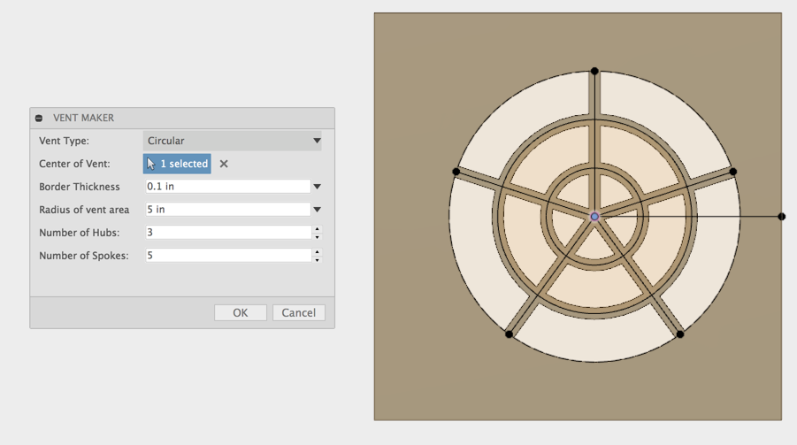

# Fusion 360 Vent Maker
Create vents quickly and easily

# Installation
[Click here to download the Add-in](https://github.com/tapnair/ventMaker/releases/download/V0.1/ventMaker.zip)

_Note that due to submodules used in this project you need to use the above link to download, unless you are familiar with using terminal commands to pull github repos_

After downloading the zip file follow the [installation instructions here](https://tapnair.github.io/installation.html) for your particular OS version of Fusion 360 

# Usage
Documentation to come later. For now:

Select a sketch point to use as the center of the vent.
The sketch point must lie on a planar face (not a reference plane)
The face of the sketch will determine the component for the feature
The vent will be cut normal to the face up to the next face it encounters.

# TODO / Enhancements:
- Add ability to rotate vent
- Add suppoprt for Blind and Through All end conditions
- Significantly better error handling
- Display Flow Area in proper units and calculate for circular
- Defer preview checkbox to handle slow updates
- Add more vent types and patterns
